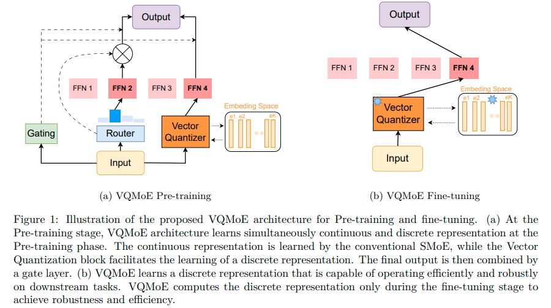

# On the Role of Discrete Representation in Sparse Mixture of Experts

[](https://opensource.org/licenses/MIT)

This repo contains the code for this paper [On the Role of Discrete Representation in Sparse Mixture of Experts](https://openreview.net/forum?id=GTWKmojpI7)

Giang Do, Kha Pham, Hung Le, Truyen Tran

## Overview

Sparse Mixture of Experts (SMoE) is an effective solution for scaling up model capacity without increasing the computational costs. A crucial component of SMoE is the router, responsible for directing the input to relevant experts; however, it also presents a major weakness, leading to routing inconsistencies and representation collapse issues. Instead of fixing the router like previous works, we propose an alternative that assigns experts to input via indirection, which employs the discrete representation of input that points to the expert. The discrete representations are learned via vector quantization, resulting in a new architecture dubbed Vector-Quantized Mixture of Experts (VQMoE). We provide theoretical support and empirical evidence demonstrating the VQMoE's ability to overcome the challenges present in traditional routers.Through extensive evaluations on both large language models and vision tasks for pre-training and fine-tuning, we show that VQMoE achieves a 28% improvement in robustness compared to other SMoE routing methods while maintaining strong performance in fine-tuning tasks.




## Prerequisite

- pytorch
- fastmoe: https://github.com/laekov/fastmoe
- transformer: https://github.com/huggingface/transformers

## Usage

##### Prepare Datasets: 
``` # Download dataset: 
bash script/table1/transformer_xl/get_data.sh
```


##### Pretraining Transformer-XL on Enwik8 and Wikitext103: 

``` # Enwik8 dataset: 
bash script/table1/transformer_xl/vqmoe/base/enwik8_vqmoe.sh
```

``` # One Billion Words dataset: 
bash script/table1/transformer_xl/vqmoe/base/lm1b_vqmoe.sh
```

``` # Text8 dataset: 
bash script/table1/transformer_xl/vqmoe/base/text8_vqmoe.sh
```

``` # Wikitext103 dataset: 
bash script/table1/transformer_xl/vqmoe/base/wik103_vqmoe.sh
```


## Acknowledgement

Our implementation is based on [fastmoe repo](https://github.com/laekov/fastmoe), [Transformer-xl repo](https://github.com/kimiyoung/transformer-xl) and [Smoe-Dropout repo](https://github.com/VITA-Group/Random-MoE-as-Dropout).

## Citation

```
@misc{do2025rolediscreterepresentationsparse,
      title={On the Role of Discrete Representation in Sparse Mixture of Experts}, 
      author={Giang Do and Kha Pham and Hung Le and Truyen Tran},
      year={2025},
      eprint={2411.19402},
      archivePrefix={arXiv},
      primaryClass={cs.LG},
      url={https://arxiv.org/abs/2411.19402}, 
}
```

